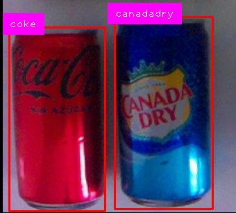
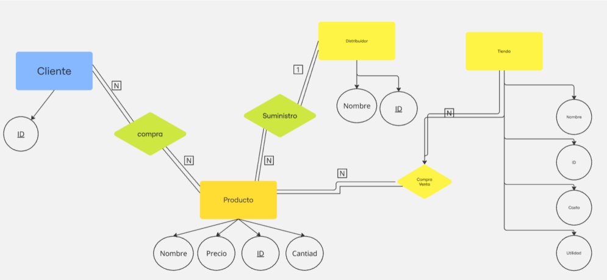
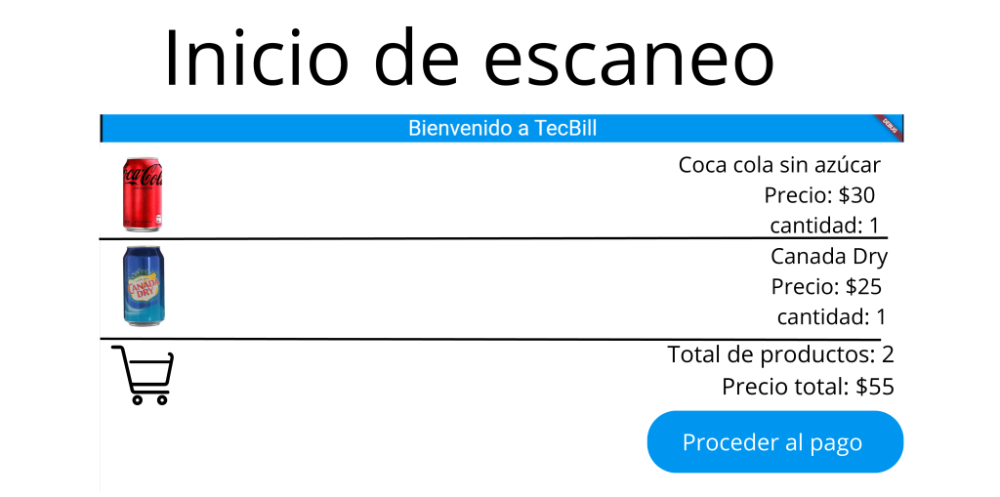

💳 TecBill — Vision Billing System

TecBill is a vision-based billing system that uses YOLOv8-nano to detect products and generate bills automatically — no barcodes needed.

🚀 Features

⚡ Real-time product detection

🧠 Automatic price lookup and billing

🖥️ Simple checkout interface

📸 Works with images, video, or webcam

📦 Product Database

🔍 Detection

🧾 Billing UI

💡 TecBill automates checkout with vision — fast, simple, and contactless.

## Example output

